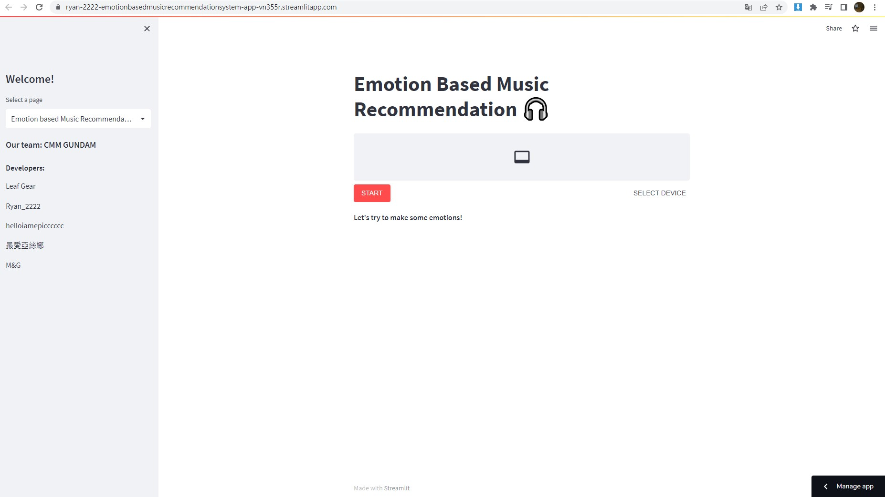
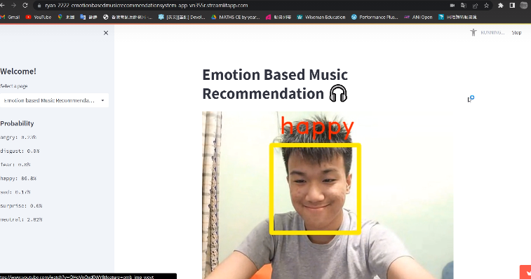
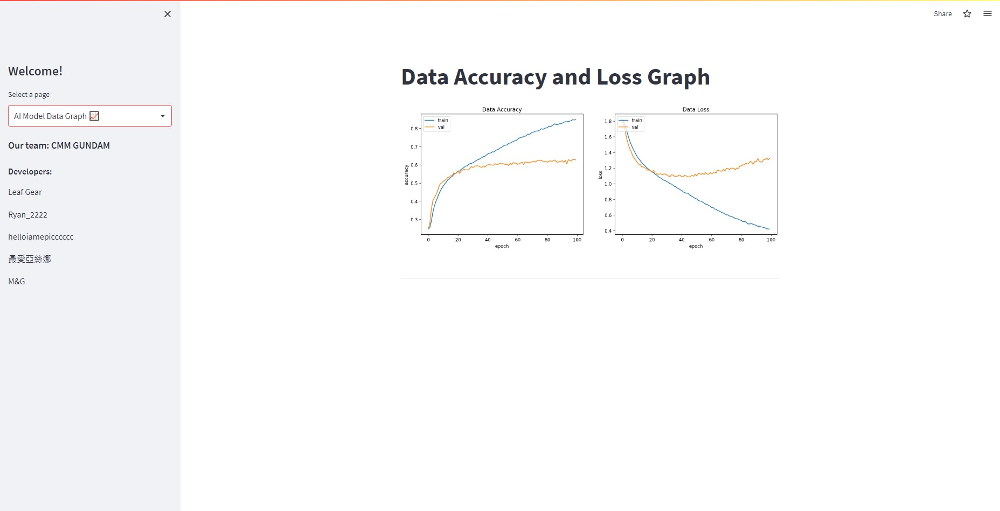

# Emotion based Music Recommendation

Recommend you a piece of music that suits you based on your current mood!

## Hardware Requirements
- A suitable camera installed 
- A PC

## Libraries Required
- Tensorflow
- Keras
- opencv-python
- pillow
- matplotlib
- scipy
- streamlit
- streamlit-player
- streamlit-webrtc

```python
pip install tensorflow
pip install keras
pip install opencv-python
pip install pillow
pip install matplotlib
pip install scipy
pip install streamlit
pip install streamlit_player
pip install streamlit_webrtc
```

or use requirements.txt

```python
pip install -r requirements.txt
```

## How to use?
- Open cmd in windows.
- Run the program with the following command in cmd.

```python
py main.py
```

After running for a while, the program will direct you to your browser with the server hosting.
Here is the UI.



I have also hosted the app in streamlit share. Check it here.

https://ryan-2222-emotionbasedmusicrecommendationsystem-app-stre-shohx2.streamlitapp.com/

Click the start button and wait a while. You will see your face inside the box!



Enjoy your music time!

###### Notice: Music can be edited on ```songs/{emotion}.txt``` if you would like to.

## Graph
You may see the Graph about Data Accuracy and Data Loss of the AI model here.



---

# AI model training 

We have already trained a model for you which is saved in ```Model``` folder. However if you want to train yourself, we are using ```Kaggle fer2013``` as our training datasets. Please download the dataset ```fer2013.csv``` and place it into ```data``` folder

```python
py fer2013_process 
``` 
To process the dataset

```python
py train.py
```
To train the model

---
